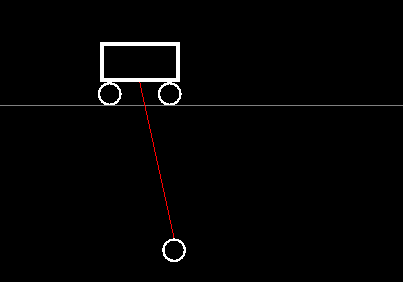
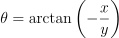
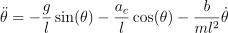
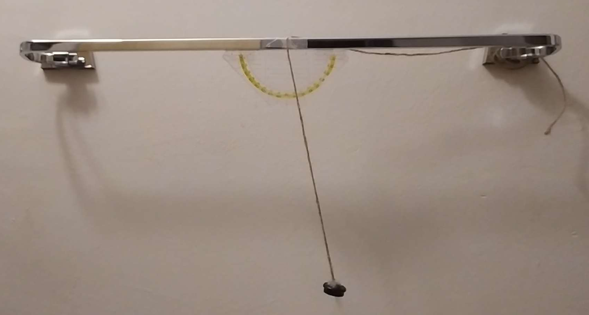
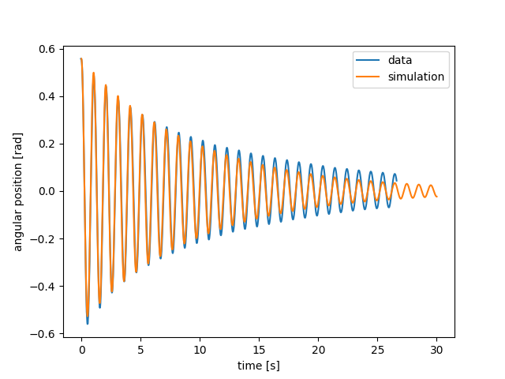
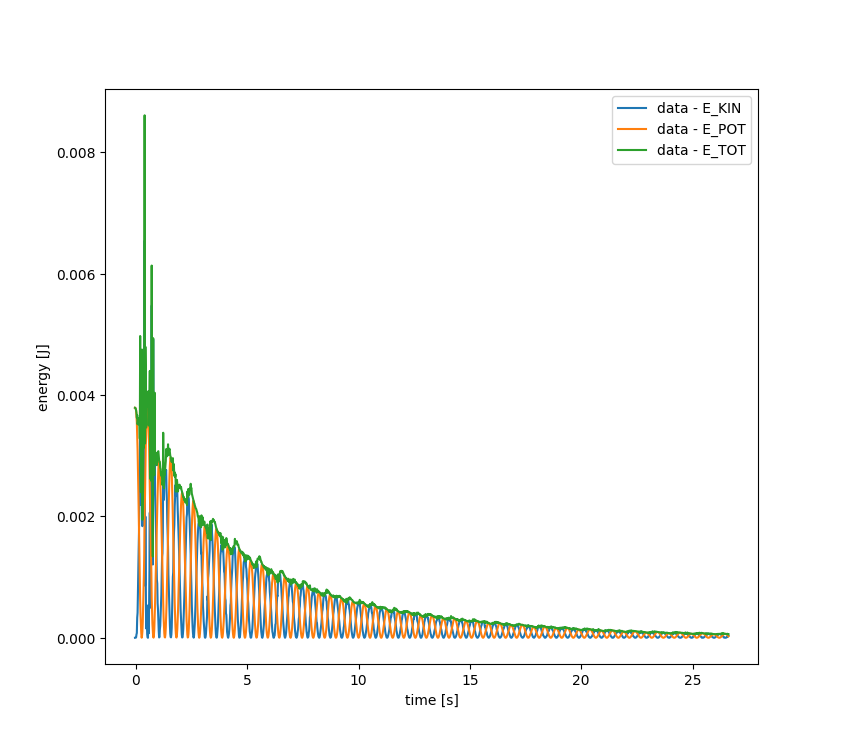
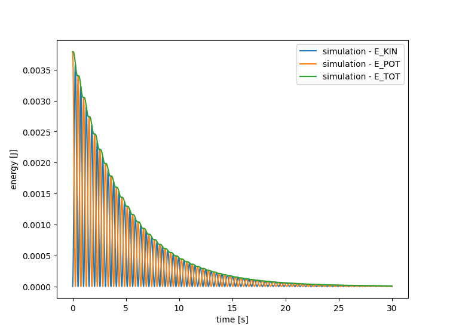
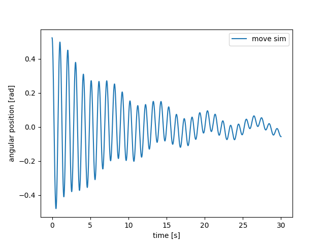

# Pendulum on a Moving Cart Simulation

  
*A simulated pendulum attached to a moving cart, compared with experimental data.*

---

## 📖 Description

This project simulates and analyzes the motion of a pendulum mounted on a moving cart.  
It combines **experimental data** (extracted from video recordings with [Tracker](https://physlets.org/tracker/)) and a **numerical simulation** to study the pendulum’s dynamics under various conditions.

The project includes tools to:
- Load and process real-world experimental data (Tracker output).
- Run simulations of a pendulum on a cart with configurable mass, length, and friction.
- Compare experimental data with the simulation by plotting:
  - Angular position, velocity, and acceleration
  - Cart motion (position, velocity, acceleration)
  - Energy (kinetic, potential, total)
  - Phase diagrams
- Test synchronization between data and simulation by analyzing maxima timings.

---

## 📂 Project Structure

```text
├── data/                   # Experimental data files (Tracker exports)
│   ├── data4.txt
│   ├── 10.txt
│   ├── 60.txt
│   ├── leger.txt
│   ├── lourd.txt
│   ├── petit.txt
│   └── long.txt
├── main.py                 # Main script to run experiments, simulations, and plots
├── simulation.py           # Pendulum and cart simulation model
├── load_tracker_data.txt   # Example Tracker data input file
├── graph.py                # Graphing utility (synchronization & maxima analysis)
└── README.md               # Project documentation
```

---

## ⚙️ How It Works

1. **Experimental Data**  
   Tracker outputs `.txt` files with `(time, x, y)` positions of the pendulum.  
   From this, the angular position `θ` is computed:  

   

2. **Simulation**  
   The pendulum dynamics are modeled using **Euler integration**:  
   
    
3. 
   where:  
   - \( g \) — gravitational acceleration  
   - \( l \) — pendulum length  
   - \( a_c \) — cart acceleration  
   - \( b \) — friction coefficient  

   The simulation supports different cart profiles:
   - `const` (fixed cart)  
   - `sinus` (harmonic oscillation)  
   - `triangle`  
   - `square`

3. **Comparison & Graphs**  
   Using `graph.py` and `main.py`, experimental data and simulations can be overlaid to validate the model.

---

## 📊 Example Outputs

- Angular position vs. time  
- Energy (kinetic, potential, total)  
- Cart motion graphs  
- Phase space diagrams  

*(Plots will display automatically when running `main.py`.)*

---

## 🚀 Getting Started

### 1) Install Dependencies
Make sure you have Python 3.9+ and install the required libraries:
```bash
pip install numpy matplotlib
```

### 2) Run a Simulation
Run the main script:
```bash
python main.py
```

This will:
- Load experimental data from `data/`
- Simulate pendulums with equivalent parameters
- Plot results for comparison

### 3) Try Different Profiles
You can create and simulate a pendulum with different cart movements:
```python
from simulation import SimulatedPendulum

pend = SimulatedPendulum("sinus_cart", 0.01, 0.25,
                         theta_0=0.3, omega_0=0,
                         friction_coefficient=0.00015)
pend.set_cart_profile_from_position("sinus", pulsation=1, amplitude=0.2)
pend.simulate()
```

---

## 🧪 Experimental Data

The `data/` folder contains different Tracker exports:
- `10.txt`, `60.txt` → Different initial amplitudes  
- `leger.txt`, `lourd.txt` → Light vs heavy pendulums  
- `petit.txt`, `long.txt` → Short vs long pendulums  

Use these to tune simulation parameters and validate accuracy.

---


The experimental data for **non-moving cart** were collected using video recording with this setup.

---

## ✅ Features

- Import and process Tracker video data  
- Pendulum-on-cart simulation with friction  
- Graphical comparison (data vs simulation)  
- Energy analysis  
- Phase space plots  
- Support for multiple cart motion profiles  

---

## 📸 Example Plots

Below are some sample plots generated by the project, illustrating both experimental data and simulations.

---

### 1. Angular Position

  
*Angular position of the pendulum over time, comparing experimental data with simulation results.*

---

### 2. Energy Analysis

The total mechanical energy is the sum of kinetic and potential energy.  
Plots below show how energy evolves in both experimental data and simulation.

**Experimental Data:**  


**Simulation:**  


---

### 3. Cart Movement Simulation

  
*Pendulum response when the cart follows a sinusoidal movement profile.*

---

📌 These plots are generated automatically when running `main.py` and can be customized by changing pendulum parameters (mass, length, friction) or cart motion profiles (`const`, `sinus`, `triangle`, `square`).

---

## 📜 License

This project is open-source and available under the **MIT License**.
